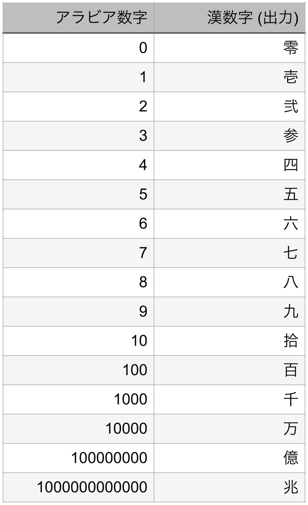

# kanjinumbers.com

アラビア数字 <=> 漢数字双方向変換WebAPI

## 要件
- kanjinumbers.com は、領収書や小切手に記載するような「壱万五千」のような表記を取り扱うサービスです。
- 「壱万五千」のような表記を、大字表記の漢数字といいます。
- kanjinumbers.com は、アラビア数字から大数表記の漢数字に変換するサービスと、大字表記の漢数字からアラビア数字に変換するサービスで構成されます。
- 通常は、WebAPI 経由で他のシステムから利用されることを想定していますが、サービスの理解のためブラウザでアクセスできる UI を提供します。 

## 仕様
・漢数字の対応は以下の通りとします。


- アラビア数字を漢数字に変換するには、まず数を下位から４桁ずつ区切り、「万」、「億」、「兆」の単位をつけて上位から読みます。４桁の組の中では「千」「百」「拾」を単位として区切り上位から読みます。
- 通常の現代日本語において、百位または十位が 1 のとき、「一百」と言わずに「百」「十」としますが、kanjinumbers.com では大字表記がサービスのウリなので、「壱百」「壱拾」と省略せずに表記します。
- 千の位、万、億、兆の位が 1 のとき、「一千」と表記するのではなく、「壱千」とします。
- 取り扱い可能な数字の範囲は、0 以上、9999 兆 9999 億 9999 万 9999 以下の整数値とします。
- API のエンドポイントは以下のとおりとします。
 - アラビア数字から漢数字: /v1/number2kanji/{変換元のアラビア数字}
 - 漢数字からアラビア数字:/v1/kanji2number/{変換元の漢数字}
- 変換できない入力の場合は、HTTP のステータスコード 204 を返します。

## 変換例


## 事前準備
### インストールが必要なもの
- Go
- docker / docker-compose

### API仕様
API仕様はSwaggerUIを利用して閲覧します。
```
$ docker-compose up -d
```
を実行することでローカルのDocker上にSwaggerUIサーバが起動します。<br>
<br>
SwaggerUIサーバ起動後以下のURLからSwaggerUIへアクセスすることができます。

SwaggerUI: <http://localhost:3000/> <br> 
定義ファイル: `./api/openapi.yaml`<br>


## APIローカル起動方法
```
$ go run ./cmd/main.go
```
